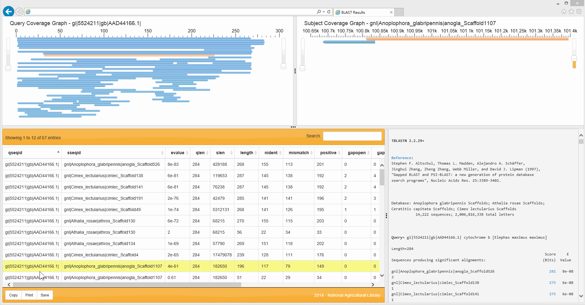

# Genomic-Workspace

## Live site

### BLAST: https://i5k.nal.usda.gov/webapp/blast/

### HMMER: https://i5k.nal.usda.gov/webapp/hmmer/

### Clustal: https://i5k.nal.usda.gov/webapp/clustal/

## Backend

* Implemented in [Python](https://www.python.org/) with [Django](https://www.djangoproject.com/).
* Supports searches for [blast](http://blast.ncbi.nlm.nih.gov/Blast.cgi?PAGE_TYPE=BlastDocs&DOC_TYPE=Download), [HMMER](http://hmmer.org/), and [Clustal](http://www.clustal.org/).
* Task queue with [RabbitMQ](http://www.rabbitmq.com/).
* Use [PostgreSQL](https://www.postgresql.org/) as databae backend.
* Generates all BLAST output formats for download: Text, CSV, TSV, XML, ASN.1.
* Converts BLAST output to GFF3 by grouping contiguous HSPs with identical query sequence, subject sequence, strand direction and an overlap length less than 6 between neighbouring HSPs under the same match.
* Retrieve previous results with a unique URL for every task.
* Supports only on Linux.

## Frontend

The results page is an interactive data viewer, query and subject coverage graphs on the top are drawn dynamically on the HTML5 canvas for every high scoring pair (HSP), tabular output from BLAST+ is displayed in a sortable and searchable table on the bottom right, pairwise text output is displayed on the bottom left panel.

* Fullscreen design dynamically scales to any screen size
* Dynamically draws a unique query coverage graph and a subject coverage graph for every high scoring pair(HSP) on HTML5 canvas.
* Interactive graph updates the page as the user mouse over each aligned segment.
* Graph zoom level and line height are first calculated according to the data and screen size, but can be easily adjusted to user's preference using the sliders on the left and right sides of each graph.
* Interactive results table updates the page as the user:
  * Mouse over each row.
  * Changes the sorting column.
  * Filters the table using the search box.

## Screenshots

BLAST Results

## Documentation

On [readthedocs.io](http://genomics-workspace.readthedocs.io/en/latest/).
